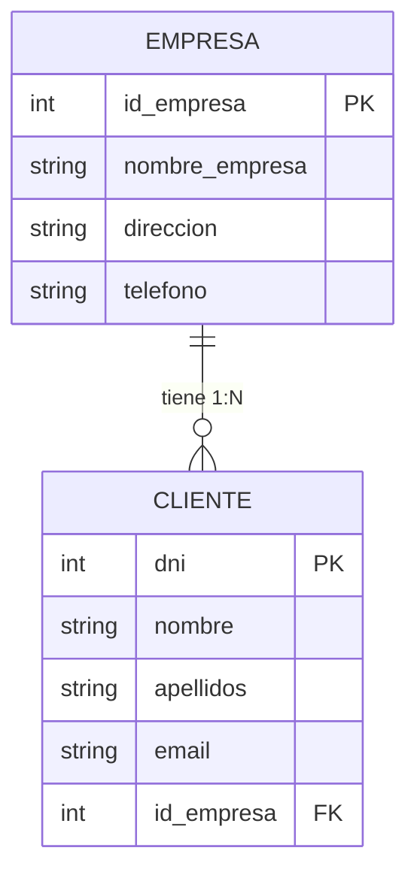

# 1. Introducción al Modelo de Datos
-

Primero, identificamos las entidades y sus atributos según lo que mencionaste:


## Entidad: Empresa
> - id_empresa (clave primaria)
> - nombre_empresa
> - direccion (opcional)
> - telefono (opcional)

## Entidad: Cliente
> - dni (clave primaria)
> - nombre
> - apellidos
> - email
id_empresa (clave foránea que indica a qué empresa pertenece)


# 2. Desarrollo del Modelo: Diagrama Entidad-Relación (ERD)
### Diagrama ERD de Escuela


### Relación:
Empresa 1 --- N Cliente


# 3. Aplicación Práctica: Creación de la Base de Datos

### 1.Crear bases de daros para trabajar en ella 
```
Create DATABASE 001_modello_de_datos;
```
### 2.Abrimos la bases de datos que 
```
USE 001_modello_de_datos;
```


### 3.Create tabla de Empresa. id_empresa es Primary Key + es AUTO_INCREMENT, nombre_emoresa es Not null

Resultado en tabla
-
| Field          | Type         | Null | Key | Default | Extra          |
|:----------------|:--------------:|:------:|:-----:|:---------:|:----------------:|
| id_empresa     | int          | NO   | PRI | NULL    | auto_increment |
| nombre_empresa | varchar(100) | NO   |     | NULL    |                |
| direccion      | varchar(200) | YES  |     | NULL    |                |
| telefono       | varchar(15)  | YES  |     | NULL    |                |
```
EL codigo de tabla
-
CREATE TABLE Empresa (
    id_empresa INT AUTO_INCREMENT,
    nombre_empresa VARCHAR(100) NOT NULL,
    direccion VARCHAR(200),
    telefono VARCHAR(15),
    PRIMARY KEY (id_empresa)
);
```


### 4.Create tabla de Cliente dni es primary key , id_empresa es Foreign key de tabla Empresa

#### Resultado en tabla 

| Field      | Type         | Null | Key | Default | Extra |
|:------------:|:--------------:|:------:|:-----:|:---------:|:-------:|
| dni        | varchar(10)  | NO   | PRI | NULL    |       |
| nombre     | varchar(50)  | NO   |     | NULL    |       |
| apellidos  | varchar(50)  | NO   |     | NULL    |       |
| email      | varchar(100) | YES  |     | NULL    |       |
| id_empresa | int          | YES  | MUL | NULL    |       |

#### EL codigo de tabla cliente

```
CREATE TABLE Cliente (
    dni VARCHAR(10) PRIMARY KEY ,
    nombre VARCHAR(50) NOT NULL,
    apellidos VARCHAR(50) NOT NULL,
    email VARCHAR(100),
    id_empresa INT,
    FOREIGN KEY (id_empresa) REFERENCES Empresa(id_empresa)
);
```


### 5.Insertar values en la tabla Emoresa

#### El codigo


```


INSERT INTO Empresa VALUES 
    (NULL, 'Tech Solutions', 'Calle Falsa 123', '555-1234'),
    (NULL, 'Innova Corp', 'Avenida Siempre Viva 456', '555-5678');
```
#### Resultado 

| id_empresa | nombre_empresa | direccion                | telefono |
|:------------:|:----------------:|:--------------------------:|:----------:|
|          1 | Tech Solutions | Calle Falsa 123          | 555-1234 |
|          2 | Innova Corp    | Avenida Siempre Viva 456 | 555-5678 |


### 6. Insertar values en la tabla Clientesç

#### El codigo
```
INSERT INTO Cliente VALUES 
    ('12345678A', 'Juan', 'Pérez', 'juan.perez@email.com', 1),
    ('87654321B', 'Ana', 'Gómez', 'ana.gomez@email.com', 2),
    ('11223344C', 'Luis', 'Martínez', 'luis.martinez@email.com', 1);

```
#### Resultado 

| dni       | nombre | apellidos | email                   | id_empresa |
|:-----------:|:--------:|:-----------:|:-------------------------:|:------------:|
| 11223344C | Luis   | Martínez  | luis.martinez@email.com |          1 |
| 12345678A | Juan   | Pérez     | juan.perez@email.com    |          1 |
| 87654321B | Ana    | Gómez     | ana.gomez@email.com     |          2 |


# 4..-Cierre/Conclusión enlazando con la unidad

Este ejercicio me ayudó a comprender mejor cómo funcionan las bases de datos relacionales y la importancia de organizar la información mediante tablas conectadas por claves primarias y foráneas. Pude ver cómo estos conceptos se aplican en la práctica para mantener la integridad y coherencia de los datos.

En futuros proyectos o situaciones profesionales, este conocimiento me servirá para diseñar y gestionar bases de datos de forma más eficiente, optimizando la estructura y las consultas según las necesidades del sistema.


