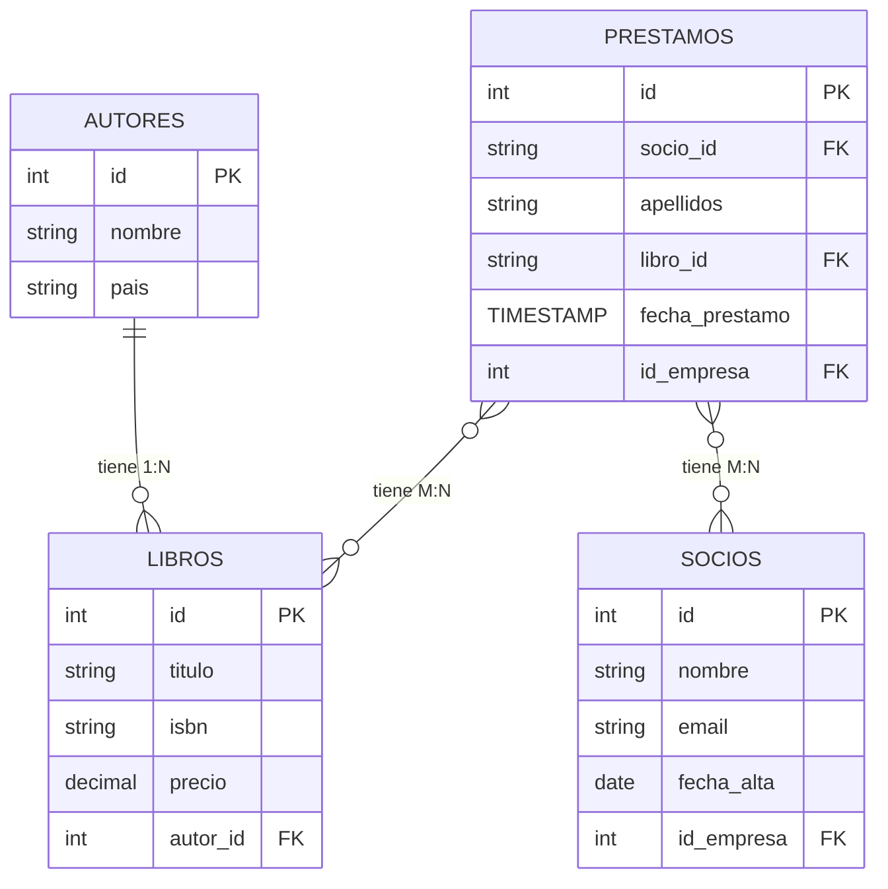

# Introduce de la practica 
El objetivo de esta práctica es desarrollar una base de datos relacional denominada biblioteca25, que permita gestionar información sobre autores, libros, socios y préstamos. Esta actividad tiene como eje central el diseño y creación de tablas relacionadas, aplicando restricciones de integridad como claves primarias, claves foráneas, unicidad, y validaciones CHECK, así como la creación de índices, vistas y usuarios con permisos específicos.


## Este es structura visual (diargarma)de bases de datos biblioteca25

#  Aplicación Práctica
Cuando Mysql a installando esribe  `sudo mysql -u root -p` para conectar en la Mysql 

### boy a crear una  bases de datos 
```
Create DATABASE biblioteca25;
```

### Abre este bases de datos que luego puedo trabajar en este bases de datos 

```
USE biblioteca25;
```

### Tiene este bases de datos or no 


| DATABASE()   |
|:--------------:|
| biblioteca25 |


### crear tablas de autores
```
CREATE TABLE autores (
  id  INT PRIMARY KEY AUTO_INCREMENT,
  nombre VARCHAR(100) NOT NULL,
  pais VARCHAR(80)
);
```
### probar que todo gurdado corecta autores
#### codigo
``` 
DESCRIBE autores
```
#### resulatado
| Field  | Type         | Null | Key | Default | Extra          |
|:--------:|:--------------:|:------:|:-----:|:---------:|:----------------:|
| id     | int          | NO   | PRI | NULL    | auto_increment |
| nombre | varchar(100) | NO   |     | NULL    |                |
| pais   | varchar(80)  | YES  |     | NULL    |                |


### crear tabla de libros

CREATE TABLE libros (
    id INT AUTO_INCREMENT PRIMARY KEY,
    titulo VARCHAR(200) NOT NULL,
    isbn VARCHAR(20) NOT NULL UNIQUE,
    precio DECIMAL(8,2) NOT NULL CHECK (precio >= 0),
    autor_id INT NOT NULL,
    CONSTRAINT fk_autor
        FOREIGN KEY (autor_id)
        REFERENCES autores(id)
        ON UPDATE CASCADE
        ON DELETE RESTRICT
);

### probar que todo gurdado corecta en tabla libros 
#### codigo

```
DESCRIBE libros;
```
#### resulatado

| Field    | Type         | Null | Key | Default | Extra          |
|:--------:|:--------------:|:------:|:-----:|:---------:|:----------------:|
| id       | int          | NO   | PRI | NULL    | auto_increment |
| titulo   | varchar(200) | NO   |     | NULL    |                |
| isbn     | varchar(20)  | NO   | UNI | NULL    |                |
| precio   | decimal(8,2) | NO   |     | NULL    |                |
| autor_id | int          | NO   | MUL | NULL    |                |

### crear una tabla socios
CREATE TABLE socios (
    id INT AUTO_INCREMENT PRIMARY KEY,
    nombre VARCHAR(100) NOT NULL,
    email VARCHAR(120) UNIQUE,
    fecha_alta TIMESTAMP NOT NULL DEFAULT CURRENT_TIMESTAMP,
    CHECK (email REGEXP '^[A-Za-z0-9._%+-]+@[A-Za-z0-9.-]+\\.[A-Za-z]{2,}$')
);
### probar que todo gurdado corecta en tabla libros 
#### codigo

```
DESCRIBE socios;
```
#### resulatado
| Field      | Type         | Null | Key | Default           | Extra             |
|:--------:|:--------------:|:------:|:-----:|:---------:|:----------------:|
| id         | int          | NO   | PRI | NULL              | auto_increment    |
| nombre     | varchar(100) | NO   |     | NULL              |                   |
| email      | varchar(120) | YES  | UNI | NULL              |                   |
| fecha_alta | timestamp    | NO   |     | CURRENT_TIMESTAMP | DEFAULT_GENERATED |


### craeo tabla prestamos
CREATE TABLE prestamos(
    id INT AUTO_INCREMENT PRIMARY KEY,
    socio_id INT NOT NULL,
    libro_id INT NOT NULL,
    fecha_prestamo TIMESTAMP NOT NULL DEFAULT CURRENT_TIMESTAMP,
    fecha_devolucion TIMESTAMP,
    check(fecha_devolucion IS NULL OR fecha_devolucion >= fecha_prestamo ),
    CONSTRAINT fk_socio
        FOREIGN KEY (socio_id)
        REFERENCES socios(id)
        ON UPDATE CASCADE
        ON DELETE RESTRICT,
    
    CONSTRAINT fk_libro
        FOREIGN KEY (libro_id)
        REFERENCES libros(id)
        ON UPDATE CASCADE
        ON DELETE RESTRICT,
    UNIQUE KEY uq_socio_libro (socio_id, libro_id)

);

### probar que todo gurdado corecta en tabla libros 
#### codigo

```
DESCRIBE prestamos ;
```
#### resulatado


| Field            | Type      | Null | Key | Default           | Extra             |
|:--------:|:--------------:|:------:|:-----:|:---------:|:----------------:|

| id               | int       | NO   | PRI | NULL              | auto_increment    |
| socio_id         | int       | NO   | MUL | NULL              |                   |
| libro_id         | int       | NO   | MUL | NULL              |                   |
| fecha_prestamo   | timestamp | NO   |     | CURRENT_TIMESTAMP | DEFAULT_GENERATED |
| fecha_devolucion | timestamp | YES  |     | NULL              |                   |


### otro variante para probar si todo corecta
```
SHOW INDEX FROM prestamos;
```

| Table     | Non_unique | Key_name       | Seq_in_index | Column_name | Collation | Cardinality | Sub_part | Packed | Null | Index_type | Comment | Index_comment | Visible | Expression |
|:-----------:|:------------:|:----------------:|:--------------:|:-------------:|:-----------:|:-------------:|:----------:|:--------:|:------:|:------------:|:---------:|:---------------:|:---------:|:------------:|
| prestamos |          0 | PRIMARY        |            1 | id          | A         |           0 |     NULL |   NULL |      | BTREE      |         |               | YES     | NULL       |
| prestamos |          0 | uq_socio_libro |            1 | socio_id    | A         |           0 |     NULL |   NULL |      | BTREE      |         |               | YES     | NULL       |
| prestamos |          0 | uq_socio_libro |            2 | libro_id    | A         |           0 |     NULL |   NULL |      | BTREE      |         |               | YES     | NULL       |
| prestamos |          1 | fk_libro       |            1 | libro_id    | A         |           0 |     NULL |   NULL |      | BTREE      |         |               | YES     | NULL       |


### vale voy ver todos los tablas que creo `SHOW TABLES`


| Tables_in_biblioteca25 |
|:------------------------:|
| autores                |
| libros                 |
| prestamos              |
| socios                 |


### cundo hace todo los tablas voy a insertae values en tablas 

### Inseto values en tablas autores
INSERT INTO autores (nombre) VALUES 
('Gabriel Garcia Marquez'),
('Isabel Allende'),
('J.K. Rowling');

### resultado de inserto `SELECT * FROM autores;`

| id | nombre                 | pais |
|:----:|:------------------------:|:------:|
|  1 | Gabriel Garcia Marquez | NULL |
|  2 | Isabel Allende         | NULL |
|  3 | J.K. Rowling           | NULL |


### Inseto values en tablas libros
```
INSERT INTO libros (titulo, isbn, precio, autor_id) VALUES
('Cien Años de Soledad', '978-3-16-148410-0', 25.50, 1),
('La Casa de los Espíritus', '978-84-00-08955-9', 20.00, 2),
('Harry Potter y la Piedra Filosofal', '978-84-8004-123-4', 30.00, 3);
```
### resultado de inserto `SELCT * FROM libros;`

| id | titulo                             | isbn              | precio | autor_id |
|:----:|:------------------------------------:|:-------------------:|:--------:|:----------:|
|  1 | Cien Años de Soledad               | 978-3-16-148410-0 |  25.50 |        1 |
|  2 | La Casa de los Espíritus           | 978-84-00-08955-9 |  20.00 |        2 |
|  3 | Harry Potter y la Piedra Filosofal | 978-84-8004-123-4 |  30.00 |        3 |


### Inseto values en tablas libros socios
```
INSERT INTO socios (nombre, email, fecha_alta) VALUES
('Juan Perez', 'juan.perez@email.com', CURRENT_DATE),
('Maria Lopez', 'maria.lopez@email.com', CURRENT_DATE);
```
### resultado de inserto `SELECT * FROM socios;`

| id | nombre      | email                 | fecha_alta          |
|:----:|:-------------:|:-----------------------:|:---------------------:|
|  1 | Juan Perez  | juan.perez@email.com  | 2025-10-31 00:00:00 |
|  2 | Maria Lopez | maria.lopez@email.com | 2025-10-31 00:00:00 |


### Inseto values en tablas libros prestamos
```
INSERT INTO prestamos (socio_id, libro_id, fecha_prestamo, fecha_devolucion) VALUES
(1, 1, CURRENT_TIMESTAMP, NULL);

INSERT INTO prestamos (socio_id, libro_id, fecha_prestamo, fecha_devolucion) VALUES
(2, 2, '2025-10-01', '2025-10-15');
```

### resultado de inserto `SELCT * FROM prestamos;`
| id | socio_id | libro_id | fecha_prestamo      | fecha_devolucion    |
|:----:|:----------:|:----------:|:---------------------:|:---------------------:|
|  1 |        1 |        1 | 2025-10-31 11:48:50 | NULL                |
|  2 |        2 |        2 | 2025-10-01 00:00:00 | 2025-10-15 00:00:00 |


# Codigo completa 
```
Create DATABASE biblioteca25;
USE biblioteca25;
CREATE TABLE autores (
  id  INT PRIMARY KEY AUTO_INCREMENT,
  nombre VARCHAR(100) NOT NULL,
  pais VARCHAR(80)
);
CREATE TABLE libros (
    id INT AUTO_INCREMENT PRIMARY KEY,
    titulo VARCHAR(200) NOT NULL,
    isbn VARCHAR(20) NOT NULL UNIQUE,
    precio DECIMAL(8,2) NOT NULL CHECK (precio >= 0),
    autor_id INT NOT NULL,
    CONSTRAINT fk_autor
        FOREIGN KEY (autor_id)
        REFERENCES autores(id)
        ON UPDATE CASCADE
        ON DELETE RESTRICT
);
CREATE TABLE socios (
    id INT AUTO_INCREMENT PRIMARY KEY,
    nombre VARCHAR(100) NOT NULL,
    email VARCHAR(120) UNIQUE,
    fecha_alta TIMESTAMP NOT NULL DEFAULT CURRENT_TIMESTAMP,
    CHECK (email REGEXP '^[A-Za-z0-9._%+-]+@[A-Za-z0-9.-]+\\.[A-Za-z]{2,}$')
);
CREATE TABLE prestamos(
    id INT AUTO_INCREMENT PRIMARY KEY,
    socio_id INT NOT NULL,
    libro_id INT NOT NULL,
    fecha_prestamo TIMESTAMP NOT NULL DEFAULT CURRENT_TIMESTAMP,
    fecha_devolucion TIMESTAMP,
    check(fecha_devolucion IS NULL OR fecha_devolucion >= fecha_prestamo ),
    CONSTRAINT fk_socio
        FOREIGN KEY (socio_id)
        REFERENCES socios(id)
        ON UPDATE CASCADE
        ON DELETE RESTRICT,
    
    CONSTRAINT fk_libro
        FOREIGN KEY (libro_id)
        REFERENCES libros(id)
        ON UPDATE CASCADE
        ON DELETE RESTRICT,
    UNIQUE KEY uq_socio_libro (socio_id, libro_id)

);
DESCRIBE prestamos;
SHOW INDEX FROM prestamos;
SHOW TABLES;
INSERT INTO autores (nombre) VALUES 
('Gabriel Garcia Marquez'),
('Isabel Allende'),
('J.K. Rowling');
SELECT * FROM autores;
INSERT INTO libros (titulo, isbn, precio, autor_id) VALUES
('Cien Años de Soledad', '978-3-16-148410-0', 25.50, 1),
('La Casa de los Espíritus', '978-84-00-08955-9', 20.00, 2),
('Harry Potter y la Piedra Filosofal', '978-84-8004-123-4', 30.00, 3);
SELECT * FROM libros; 
INSERT INTO socios (nombre, email, fecha_alta) VALUES
('Juan Perez', 'juan.perez@email.com', CURRENT_DATE),
('Maria Lopez', 'maria.lopez@email.com', CURRENT_DATE);
INSERT INTO prestamos (socio_id, libro_id, fecha_prestamo, fecha_devolucion) VALUES
(1, 1, CURRENT_TIMESTAMP, NULL);

INSERT INTO prestamos (socio_id, libro_id, fecha_prestamo, fecha_devolucion) VALUES
(2, 2, '2025-10-01', '2025-10-15');
SELECT * FROM prestamos;

```


# Conclusión enlazando con la actividad 
La realización de esta actividad permitió consolidar los conocimientos sobre modelado y gestión de bases de datos relacionales mediante la creación de la base biblioteca25. A lo largo del ejercicio se aplicaron principios de integridad de datos, como claves primarias, claves foráneas con acciones CASCADE o RESTRICT, restricciones CHECK, y unicidad, asegurando que la información se mantuviera coherente y confiable.

Además, se diseñaron índices para optimizar las consultas, se creó una vista de préstamos activos para facilitar el seguimiento de los libros prestados y se implementó un usuario de solo lectura, reforzando buenas prácticas de seguridad
