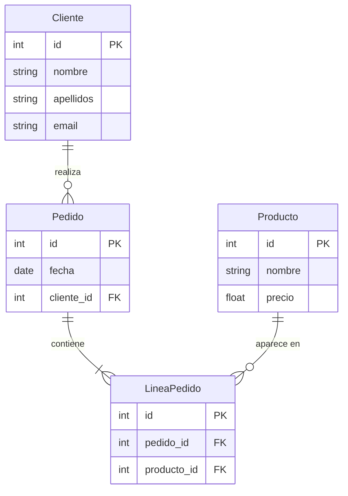

# 1.-Indroduccion brece y contexalizacion

En esta unidad se ha trabajado sobre el diseño y la implementación de bases de datos relacionales, utilizando diagramas entidad-relación (ER) como herramienta principal para modelar la información de manera estructurada. El presente ejercicio consiste en analizar un ejemplo de tienda online, comprendiendo cómo se representan las entidades principales —Cliente, Pedido, Producto y LíneaPedido— y sus relaciones, así como en implementar estas estructuras en un entorno real mediante SQL y Python. Esta actividad permite consolidar los conocimientos sobre integridad referencial, normalización de datos y operaciones CRUD, vinculando la teoría con la práctica.


# 2.-Desarrollo técnico correcto y preciso
## tienda online.html 
### este archivo hago con pagina [jocarsadiagrama](https://jocarsa.github.io/diagrama/) por eso para ver mejor creo este table con `mermaid`
### analiz
#### creo tablas 
* Cliente tiene colmnas `id` `nombre` `apellidos` `email`
* Pedido tiene columna `id` `fetcha` `cliente_id`
* LineaPedido tiene columna `id` `pedido_id` `producto_id`
* Producto tiene columna `id` `nombre` `precio`ç


## tienda online.sql
### creo base de datos
```
CREATE DATABASE tienda_online;
USE tienda_online;
```
### creo tabla `cliente` `pedido` `lineapedido` `producto`
```
CREATE TABLE cliente (
  id INT PRIMARY KEY,
  nombre VARCHAR(255),
  apellidos VARCHAR(255),
  email VARCHAR(255)
);

CREATE TABLE pedido (
  id INT PRIMARY KEY,
  fecha VARCHAR(255),
  cliente_id INT,
  CONSTRAINT fk_pedido_1 FOREIGN KEY (cliente_id) REFERENCES cliente(id)
);

CREATE TABLE lineapedido (
  id INT PRIMARY KEY,
  pedido_id INT,
  producto_id INT,
  CONSTRAINT fk_lineapedido_1 FOREIGN KEY (pedido_id) REFERENCES pedido(id),
  CONSTRAINT fk_lineapedido_2 FOREIGN KEY (producto_id) REFERENCES producto(id)
);

CREATE TABLE producto (
  id INT PRIMARY KEY,
  nombre VARCHAR(255),
  precio VARCHAR(255)
);
```
## tienda onlihe.py
### creo clases `cliente` `pedido` `lineapedido` `producto` para implimitacion de la py
```
class Cliente:
    def __init__(self, id, nombre, apellidos, email):
        self.id = id
        self.nombre = nombre
        self.apellidos = apellidos
        self.email = email


class Producto:
    def __init__(self, id, nombre, precio):
        self.id = id
        self.nombre = nombre
        self.precio = precio


class Pedido:
    def __init__(self, id, fecha, cliente):
        self.id = id
        self.fecha = fecha
        self.cliente = cliente   


class LineaPedido:
    def __init__(self, id, pedido, producto):
        self.id = id
        self.pedido = pedido    
        self.producto = producto 
```
## hago una CRUD 
Insertar clientes
INSERT INTO cliente (id, nombre, apellidos, email) VALUES
(1, 'Juan', 'Pérez Gómez', 'juan@example.com'),
(2, 'María', 'López Díaz', 'maria@example.com');

Insertar productos
INSERT INTO producto (id, nombre, precio) VALUES
(1, 'Teclado mecánico', '49.99'),
(2, 'Ratón inalámbrico', '19.99'),
(3, 'Monitor 24 pulgadas', '129.99');

Insertar pedidos
INSERT INTO pedido (id, fecha, cliente_id) VALUES
(1, '2026-01-10', 1),
(2, '2026-01-11', 2);

Insertar líneas de pedido
INSERT INTO lineapedido (id, pedido_id, producto_id) VALUES
(1, 1, 1),
(2, 1, 2),
(3, 2, 3);

🔵 READ — Consultar datos
Consultar todos los clientes
SELECT * FROM cliente;

Consultar todos los pedidos con nombre del cliente
SELECT p.id, p.fecha, c.nombre, c.apellidos
FROM pedido p
JOIN cliente c ON p.cliente_id = c.id;

Consultar líneas de un pedido con detalles del producto
SELECT lp.id, pr.nombre, pr.precio
FROM lineapedido lp
JOIN producto pr ON lp.producto_id = pr.id
WHERE lp.pedido_id = 1;

🟠 UPDATE — Actualizar datos
Actualizar el email de un cliente
UPDATE cliente
SET email = 'juan.perez@example.com'
WHERE id = 1;

Actualizar el precio de un producto
UPDATE producto
SET precio = '44.99'
WHERE id = 1;

🔴 DELETE — Eliminar datos

⚠️ Si intentas eliminar registros relacionados sin hacerlo en el orden correcto, MySQL lanzará error por claves foráneas.

Eliminar una línea de pedido
DELETE FROM lineapedido
WHERE id = 3;

Eliminar un pedido (primero elimina sus líneas)
DELETE FROM lineapedido WHERE pedido_id = 2;

DELETE FROM pedido WHERE id = 2;

Eliminar un cliente (solo si ya no tiene pedidos)
DELETE FROM cliente WHERE id = 1;
# Codigo Completo
Project\  
├─ explicacion.md 
├─ tienda online.html  
├─ tienda online.sql  
├─ tienda online.py 
├─ 017-colores.py  
└─ crear_productos.sql  
## tienda online.html
```
<!DOCTYPE html>
<html lang="es">
<head>
<meta charset="UTF-8">
<title>Diagrama exportado</title>
</head>
<body>
<div class="page">

<div class="shape entity" style="left:40px;top:40px;width:220.000020345052px;height:150.40000406901038px;">
  <div class="entity-header">Cliente</div>
  <div class="entity-properties">
    <div class="entity-property">
      <div class="port port-left"></div>
      <div class="property-name">id</div>
      <div class="port port-right"></div>
    </div>
    <div class="entity-property">
      <div class="port port-left"></div>
      <div class="property-name">nombre</div>
      <div class="port port-right"></div>
    </div>
    <div class="entity-property">
      <div class="port port-left"></div>
      <div class="property-name">apellidos</div>
      <div class="port port-right"></div>
    </div>
    <div class="entity-property">
      <div class="port port-left"></div>
      <div class="property-name">email</div>
      <div class="port port-right"></div>
    </div>
  </div>
</div>
<div class="shape entity" style="left:319.11250813802076px;top:44.03749593098959px;width:219.99999999999994px;height:126.40001424153643px;">
  <div class="entity-header">Pedido</div>
  <div class="entity-properties">
    <div class="entity-property">
      <div class="port port-left"></div>
      <div class="property-name">id</div>
      <div class="port port-right"></div>
    </div>
    <div class="entity-property">
      <div class="port port-left"></div>
      <div class="property-name">fecha</div>
      <div class="port port-right"></div>
    </div>
    <div class="entity-property">
      <div class="port port-left"></div>
      <div class="property-name">cliente_id</div>
      <div class="port port-right"></div>
    </div>
  </div>
</div>
<div class="shape entity" style="left:592.862548828125px;top:113.42500813802081px;width:219.99999999999994px;height:126.40000406901038px;">
  <div class="entity-header">LineaPedido</div>
  <div class="entity-properties">
    <div class="entity-property">
      <div class="port port-left"></div>
      <div class="property-name">id</div>
      <div class="port port-right"></div>
    </div>
    <div class="entity-property">
      <div class="port port-left"></div>
      <div class="property-name">pedido_id</div>
      <div class="port port-right"></div>
    </div>
    <div class="entity-property">
      <div class="port port-left"></div>
      <div class="property-name">producto_id</div>
      <div class="port port-right"></div>
    </div>
  </div>
</div>
<div class="shape entity" style="left:321.7250162760416px;top:219.2875061035156px;width:219.99999999999994px;height:126.40000406901038px;">
  <div class="entity-header">Producto</div>
  <div class="entity-properties">
    <div class="entity-property">
      <div class="port port-left"></div>
      <div class="property-name">id</div>
      <div class="port port-right"></div>
    </div>
    <div class="entity-property">
      <div class="port port-left"></div>
      <div class="property-name">nombre</div>
      <div class="port port-right"></div>
    </div>
    <div class="entity-property">
      <div class="port port-left"></div>
      <div class="property-name">precio</div>
      <div class="port port-right"></div>
    </div>
  </div>
</div>
<div class="arrow" style="left:198.08752441406244px;top:83.63166101820605px;width:187.78675714168608px;transform:rotate(0.26715864665762246rad);"></div>
<div class="arrow" style="left:479.0000406901041px;top:88.82457440315159px;width:189.09794372669433px;transform:rotate(0.48771768056306314rad);"></div>
<div class="arrow" style="left:476.4375406901041px;top:260.22971032784835px;width:178.29067744819483px;transform:rotate(-0.31328691373194184rad);"></div>
</div>
</body>
</html>
```
## tienda online.sql
```
CREATE DATABASE tienda_online;
USE tienda_online;

CREATE TABLE cliente (
  id INT PRIMARY KEY,
  nombre VARCHAR(255),
  apellidos VARCHAR(255),
  email VARCHAR(255)
);

CREATE TABLE pedido (
  id INT PRIMARY KEY,
  fecha VARCHAR(255),
  cliente_id INT,
  CONSTRAINT fk_pedido_1 FOREIGN KEY (cliente_id) REFERENCES cliente(id)
);

CREATE TABLE lineapedido (
  id INT PRIMARY KEY,
  pedido_id INT,
  producto_id INT,
  CONSTRAINT fk_lineapedido_1 FOREIGN KEY (pedido_id) REFERENCES pedido(id),
  CONSTRAINT fk_lineapedido_2 FOREIGN KEY (producto_id) REFERENCES producto(id)
);

CREATE TABLE producto (
  id INT PRIMARY KEY,
  nombre VARCHAR(255),
  precio VARCHAR(255)
);
```
## tienda online.py
```
class Cliente:
    def __init__(self, id, nombre, apellidos, email):
        self.id = id
        self.nombre = nombre
        self.apellidos = apellidos
        self.email = email


class Producto:
    def __init__(self, id, nombre, precio):
        self.id = id
        self.nombre = nombre
        self.precio = precio


class Pedido:
    def __init__(self, id, fecha, cliente):
        self.id = id
        self.fecha = fecha
        self.cliente = cliente   


class LineaPedido:
    def __init__(self, id, pedido, producto):
        self.id = id
        self.pedido = pedido    
        self.producto = producto 
```
# 4.-Cierre/Conclusión enlazando con la unidad

El desarrollo de este ejercicio ha permitido aplicar los conceptos fundamentales de la unidad, desde la interpretación de diagramas ER hasta la creación y manipulación de bases de datos mediante SQL y Python. La experiencia refuerza la importancia de un diseño bien estructurado para garantizar la consistencia, eficiencia y mantenibilidad de la información. Además, demuestra cómo las operaciones CRUD y las relaciones entre entidades facilitan la gestión de datos en aplicaciones reales, consolidando la comprensión integral de los principios de bases de datos relacionales abordados en la unidad.


