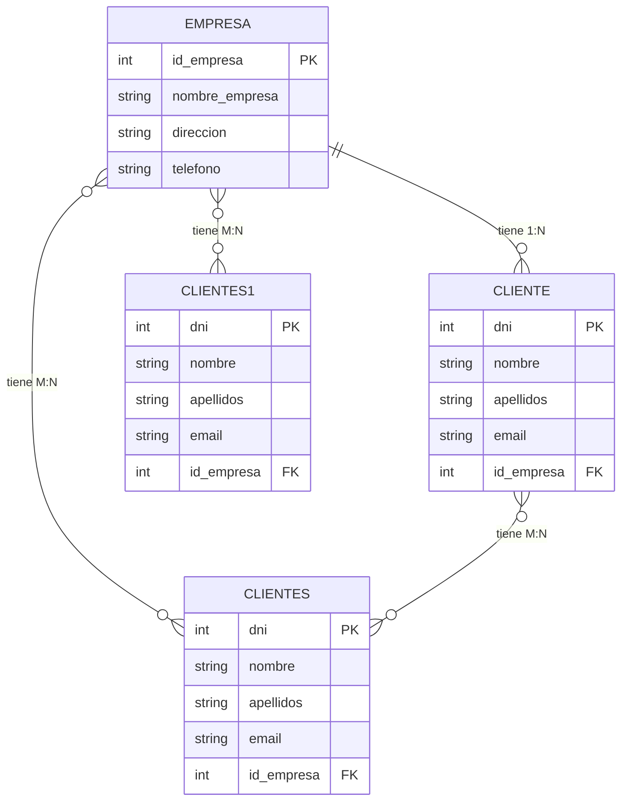

```mermaid
erDiagram
    EMPRESA {
        int id_empresa PK
        string nombre_empresa 
        string direccion
        string telefono
    }

    CLIENTE {
        int dni PK
        string nombre
        string apellidos
        string email
        int id_empresa FK
    }

    CLIENTES {
        int dni PK
        string nombre
        string apellidos
        string email
        int id_empresa FK
    }

    CLIENTES1 {
        int dni PK
        string nombre
        string apellidos
        string email
        int id_empresa FK
    }

    EMPRESA ||--o{ CLIENTE : "tiene 1:N"
    EMPRESA }o--o{ CLIENTES : "tiene M:N"
    EMPRESA }o--o{ CLIENTES1 : "tiene M:N"
    CLIENTE }o--o{ CLIENTES : "tiene M:N"


```