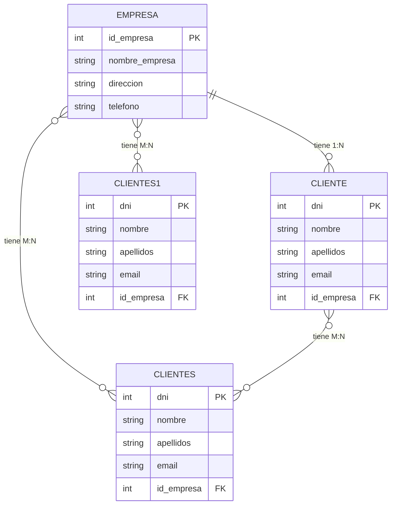

Create DATABASE 003_Tipos_de_datos;
USE 003_Tipos_de_datos;
sudo mysql -u root -p


## 1.-Indroduccion brece y contexalizacion


## 2.-Desarrollo técnico correcto y preciso

1.
```

```

2.
```

       
```
3.
```

```
4.
```
 

```
5.
```
 

```
6.
```
  
```

## Codigo Completo

```

```

## 4.-Cierre/Conclusión enlazando con la unidad


